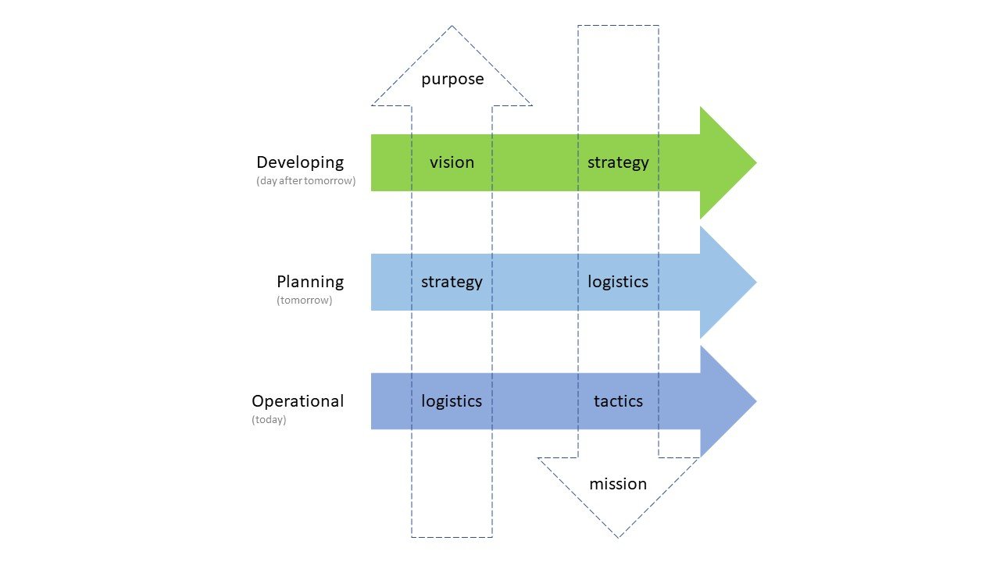
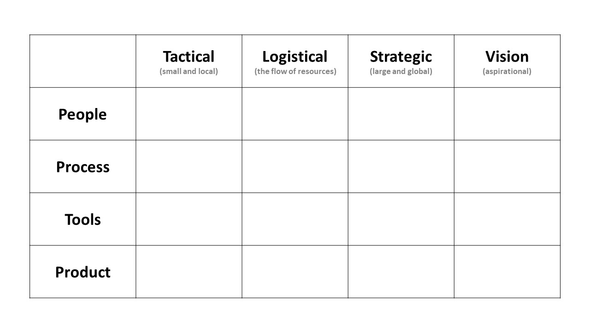
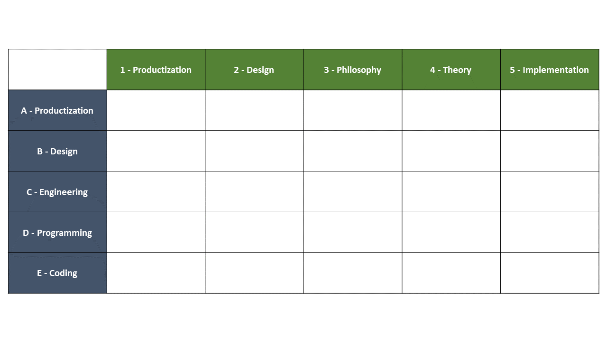
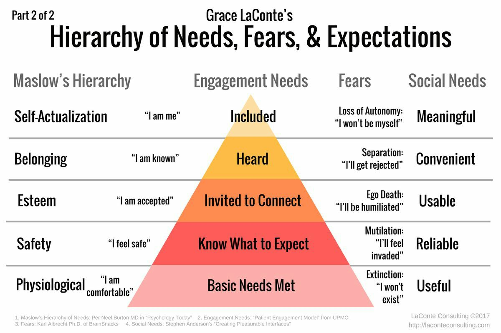

## Appendix 1 - Narrative Structure Framework

### Three time baselines
  
  

### Matrix of Categorical Functions

  

### Taxonomy of Levels of Technical Conversations

  

#### *LEVELS*
  * A - PRODUCTIZATION: Delivering Customer Value to create profit. 
  * B - DESIGN: Creating solutions to resolve problems that cause customer pain 
  * C - ENGINEERING: Writing, testing, maintaining, upgrading, documenting, and operating the system – at the org level
  * D - PROGRAMMING: Writing, testing, maintaining, upgrading, documenting, and operating the program – at the team level
  * E - CODING: Writing, testing, maintaining, upgrading, documenting, and operating the code – at the person level

#### *TOPICS*
  * 1 - PRODUCTIZATION: Delivering Customer Value in the domain to create profit. 
  * 2 - DESIGN: Creating solutions to resolve problems in the domain that cause customer pain 
  * 3 - PHILOSOPHY: Wisdom about the domain that helps you see that domain in the world
  * 4 - THEORY: Wisdom that shapes how you form intentions when you interact with the world in the domain  
  * 5 - IMPLEMENTATION: Domain-specific details about how to practice in the domain

  A statement has both a topic and a level.  Ex. "Be stateless first.  If state is required, it must be shared.  When state is shared, it must be shared using messages."  is a Design Philosophy statement (B3).

  Good technical writing, and clear technical conversations, maintain the same Level while traversing the Topics.  This keeps the conversation clear and easy to follow and avoids rat holes.

### Maslow's Hierarchy of Needs
  
  
  
### Maturity Models
  
  

  Generic Maturity Model:

  0. Shanty - everyone is doing their own thing and competing for scarce resources
  1. Ad-hoc - no process but general concept of a common destination and cooperation
  2. Rudimentary - some primitive processes exist but aren't consistently followed
  3. Repeatable - demonstrable competence in delivering over time 
  4. Sustainable - consistently hitting targets and growing skills
  5. Optimal - finely tuned organization with no low-hanging fruit or obvious flaws in process, product, or politics
  6. Ambient - breathing the air is all it takes to integrate and become highly functional
