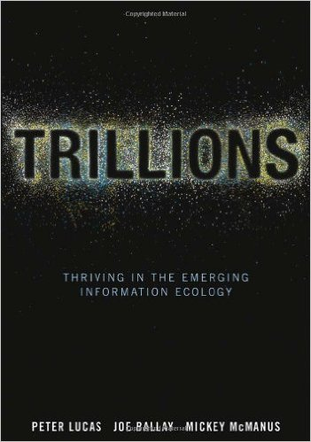

## Appendix 2 - Doctrine

### Antifragile 

* Resiliency doesn't scale
* Availability at scale is really adaptability
* _Getting stronger because of systemic stressors is the acme of "Availability"_
### The Box

* Commoditization radically alters everything
* Standard containers means you don't care what's inside
* _The conveyance of fungible containers for inconsequential contents is the acme of "Fast"_
### Trillions

* We are thinking too small about the Internet of Things
* Design matters a lot more when there is no interface
* _Cutting away the overhead is the acme of "Scale"_
### Liars and Outliers

* Trust is a social problem
* Secure (and safe) are states in a social "state machine"
* _Ascertaining trustworthiness is the acme of "Secure"_
