# The Future as Prelude

## [Anthropocene](https://www.anthropocene.info/)

* [Affordance](https://www.interaction-design.org/literature/topics/affordances)

    `Affordances are properties of environmental structures that provide opportunities for action to complementary organisms`

* Technology 
    
    `Tools and the knowledge to use them`

* Power

    Tool use gives humans power over other animals.  This power gives rise to civilization.  Civilization refines power.  As this refinement goes on, the particulars change and evolve. 

    In this model, there are three Eras of civilization, and in each era there is an Enabling Revolution which changes the way Humans impose their will on the planet, a Motive Capital that powers that Enabling Revolution, and an Emerging Power which is maturing and likely to incite the Next Revolution.

    The connection between the Enabling Revolution and the Motive Capital is direct, and those who have the most or the best Capital are likely to be able to have the most freedom of action because they are not only most able to live life on their own terms, they are also able to set the terms in the lives of others.

    The connection between the Motive Capital and the the Emerging Power is more subtle.  Those early masters certainly can gain in the immediate time frame but the real effect of the Emerging Power tends to be felt _in the ability to accumulate and control the next Era's_ Motive Capital -- the Mastery of Finance enables one to own more Machines; Mastery of Culture enables one to have better Applications; etc..

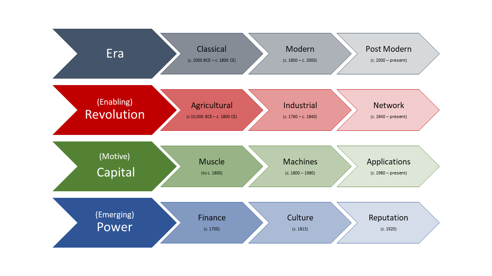

* Resources

  The Motive Capital points directly to the Critical Resources that must be controlled to attain and maintain the ability to act independently; muscle needs bodies and overseers, machines need engineers and experimenters, applications need brains.

  The critical insight here is that scaling brains is _unlike_ scaling engineers or experimenters or overseers or bodies.  
  
  _Brains do not have economies of scale, or at least not economies of scale in the way that the industrial world has economies of scale._

  * [Scaling engineers at Uber from 200 to 2000](https://youtu.be/kb-m2fasdDY)
  * 

### Internetworked
_Telegraph >> Telephone >> Radio >> Telecommunication_

`tele:  at a distance`

_What does telecommunications afford to humans?_

Communicating at a distance with fidelity, authenticity, and speed gives humanity the approximation of conquering space in many contexts.

_Conquering Space forces Time to the forefront_

_Time affords the ability to orient events to create understanding_

Time as a governing dynamic of understanding
* Timezones dis-unify events through the use of a built environment to localize experiences, even experiences which are global.
* Timeboxing 
* TimeMachine / Playback / Instant Replay

Time Arbitrage as a lever for gain
* [Fastboys]()
* [Two-second Advantage]()

#### 

_Networks of Networks afford tools for building tools_
#### Policy Defined Networks
* Differentiated Services
  
  _Application Delivery is the differentiation of services._ 

  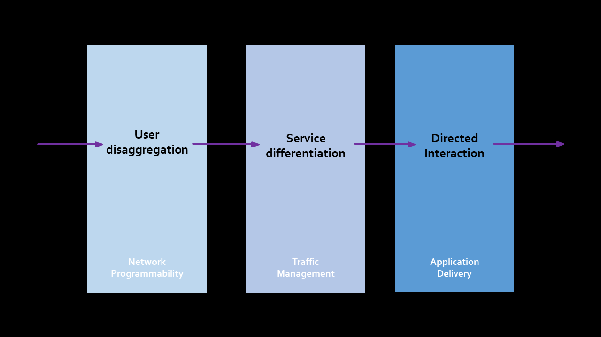

    * Fairness
    * Robustness
    * Versatility
    * Cost efficiency
#### Directory Enabled Networks

  _Specified, shared, and accessible data is the basis for secure, scalable, and available applications_

  _The directory for the Internet is the Domain Name System, however, many many people don't want it to *be* the directory for the Internet, and work tirelessly to cripple its directory service potential.  This forces lesser alternatives, which all fail in one way or the other._

  _REST APIs are not a directory.  Neither is GraphQL._ 

#### Policy Based Networking
  
  _Shared, distributed policy is the basis for safe, fast, and predictable application delivery_

  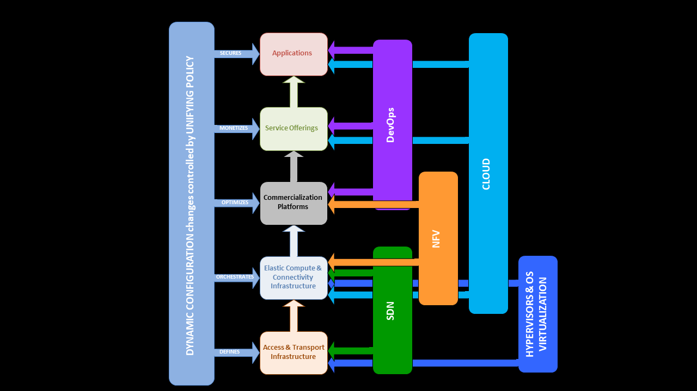

The systems model for all commercial access providers – and applicable to commercial hosting/managed services providers, large enterprises, and campus networks

* Access & Transport Infrastructure – these are wires in the ground, and the fairly static services that go along with them.  Even if there is programmability, it is generally not changing the “big” parts of this layer

* Elastic Compute & Connectivity Infrastructure (ECCI) – this is commodity hardware with free or cheap software operated at very thin margins.  (the EC2+SDN world (NVF fits here too) )

* Commercialization Platforms – this is the software (and hardware) that is the logical foundation for things that make money.  LTE is a platform, IMS is too, so are CDN, and public cloud and managed WAN.

* Service Offering – this is the product that gets sold.  VoLTE is built on top of the LTE and IMS platforms.  Video On Demand is built on top of the CDN and private cloud platforms.

* Applications – this layer contains the things that customers are buying – Voice, provided by the VoLTE service offering, built on the LTE and IMS platforms.

The Applications Layer can be further split into three sub-layers:  
  
  * The Extra-network layer, where OTT services live (Netflix, Skype, Dropbox, Google Maps); they aren’t going to win these battles
  * The Meta-network layer, where things that extend the network live (voicemail, OTA upgrade services, the operator’s app store); table-stakes - no one is going to pay for these things
  * The Kata-network layer, where applications that are alongside the network live.  They are better than analogous OTT service because of some benefit they receive from the network ( voice or video services that can seamlessly move from fixed to mobile to wifi without dropping are an example.  There are actually few good examples.)

Now using this model, lets talk about the various “Hype-movements” that make up the dynamic, programmable network.

1. First there was Hypervisors and OS virtualization, which brought back the experience of time-shared mainframe computing to PC architectures.  They impact the Access and transport Infrastructure (though not actually very much in practice) and make the ECCI possible.
  
2. Next came EC2 and from that the Cloud.  This is really about taking the ECCI and deploying services and applications.  
  
3. Because the tool chain to manage those services and applications was pretty bad, the DevOps movement was born.
  
4. When you apply the DevOps methodology to the management of network switching and routing, you get SDN.
  
5. Finally, when you want to use SDN and DevOps together to create commercialization platforms on ECCI to clean out your logistics chain, you get NFV.

While each of those five “hype-movements” have different origins, wire protocols, terminology, and governing organizations, they are all doing the same thing – remote configuration changes.  And none of them can singlehandedly execute all five phases of the lifecycle model we looked at earlier.

Much of that has to do with the different priority a configuration change has within each layer of this model.

* At the Access and Transport Infrastructure layer, what is most important is the defining the service level being used
  
* At the ECCI layer, what is most important is the coordination of the changes between the compute, the connectivity, and the storage
  
* At the Commercialization Platform layer, what is most important is the optimization of the service
  
* At the Service Offering layer, what is most important is the monetization of the offering
  
* And at the Applications layer, what is most important is the security of the application and the associated data.

_THAT DOESN’T MEAN THAT THESE THINGS AREN’T IMPORTANT AT OTHER LAYERS TOO, IT JUST MEANS THAT IS THE FOCAL POINT_.

The only way to get this full stack dynamic configuration change is to coordinate it all though the use of a unifying policy that can abstract the individual layer's interface(s).  This is, fundamentally, what a directory enabled network is, and so Policy Based Networks are derived from Directory Enabled Networks.

### Intertwingular
_Humans communicate best in information-dense mediums_
* [Edward Tufte: The Congnitive Style of PowerPoint](https://www.inf.ed.ac.uk/teaching/courses/pi/2016_2017/phil/tufte-powerpoint.pdf)
* [Jamie Zawinski: Vast Volumes of eMail](https://web.archive.org/web/20040609110124/https://www.mozilla.org/blue-sky/misc/199805/intertwingle.html)

_What does intertwingularity afford to humans?_
### Intertextual

All ideas are _proximal_ to others.  Meaning of ideas is _contingent_ on other ideas and any particular idea is always _being shaped_ by the landscape of all ideas.

In the post-modern world it is assumed that individuals exist on the landscape of all ideas and can be expected to function as part of that complex system.

* [Brand Culture: Intertextuality in a modern world](http://www.marklives.com/2017/08/brand-culture-intertextuality-in-a-modern-world/)
* [Nerdwriter: Intertextuality: Hollywood's New Currency](https://youtu.be/QeAKX_0wZWY)
* [What is Intertextuality?](https://youtu.be/4YJ49heLbrI)

_What does intertextuality afford to humans?_

_Intertextuality affords abstraction_

* [Bret Victor: the Ladder of Abstraction](http://worrydream.com/LadderOfAbstraction/)
* [Abstraction - the Art of Design](https://www.netflix.com/title/80057883)
* [Rich Hickey: The Language of the System](https://youtu.be/ROor6_NGIWU)
* [Bret Victor: The Humane Representation of Thought](https://vimeo.com/115154289)

### Intertemporal

The culmination of internetworked, intertwingular, and intertexutal culture is that we begin to lose the strict, cohesive narrative of what we have been and what we are becoming.  The accounting of our own actions becomes increasingly difficult because the factual, authentic answer to nearly any question that begins with "Why..." becomes harder and harder and harder for any group, even a group of very like minded individuals, to agree upon.  So much of the experience of an individual human is unsharbly existential and simultaneously irrefutably inauthoritative that collective meaning begins to dissolve.

* [Nerdwriter: Atemporality](https://youtu.be/ZAv5EKvRrco)

While this does initially dissolve into atemporality, it eventually becomes intertemporal, meaning that like intertextuality, all time is _proximal_ to all other time and, within the constraints of our understanding of physical time, the meaning of time is _contingent and fluid_, _being shaped and reshaped_ as we shape and reshape our ideas.

_What does intertemporality afford to humans?_

Intertemporality, in practical terms, means that the rate at which ideas evolve has become so fast that any expression of an idea is "on the clock" and begins to expire as soon as it is expressed.  The paper, video, or whiteboard session has a "best before date" and the freshness of an idea becomes something that has to be factored into decision making.

This phenomenon also pulls into relief the dichotomy between what is ultimately inconsequential bullshit and what is timeless; that all ideas live between these two poles is nearly impossible to deny when intertemporality and intertextuality both act on the landscape and the volume of bullshit - that is, ideas, activities, and beliefs that are so ["completely pointless, unnecessary, or pernicious as to be unjustifiable"][Bullshit] by any but circular reasoning - is revealed.  The value of a timeless idea, that is one which, no matter how proximal, contingent, or fluid the landscape it exists in, remains valid, requisite, and anodyne, only rises when in an environment dominated by bullshit.  Without belief in and contact with such timeless truths, humans lose the ability to reason well from correct first principles, they lose what makes them human and collectively degenerate into a ["vicious, lazy, profoundly ignorant, perpetually hungry organism"][Idoru].  

[Bullshit]: https://www.newyorker.com/books/under-review/the-bullshit-job-boom "Graeber, David, Bullshit Jobs, 2018"
[Idoru]: https://example.com/idoru "Gibson, William, Idoru, 1996"

### Human Computer Interface
_Specialized >> General Purpose >> Specialized_

_What do Computers afford to humans?_

* [Bret Victor: The Future of Programming](https://vimeo.com/71278954)

#### UX 
* [Bret Victor: Magic Ink](http://worrydream.com/MagicInk/)
* Programmable notebooks 
  * [Jupyter](https://jupyter.org/)   
  * [Observable](https://observablehq.com/)
  * [Wolfram](https://www.wolfram.com/featureset/notebooks/)
* Codeless 
  * [No Code](https://nocodehq.com/)
  * [Betty Blocks](https://www.bettyblocks.com/)
  * [NodeRED](https://nodered.org/)
* [Ambient Findability](https://learning.oreilly.com/library/view/ambient-findability/0596007655/)
* [The Best Interface is No Interface](https://learning.oreilly.com/library/view/the-best-interface/9780133890419/)
  

#### AR
* [Bret Victor: Seeing Spaces](https://vimeo.com/97903574)
* [At Dynamicland, The Building Is The Computer](https://tashian.com/articles/dynamicland/)
* [Microsoft Hololens](https://youtu.be/eqFqtAJMtYE)
* [Google Glass](https://youtu.be/5IK-zU51MU4)
* [Ubiquiti Switches with AR app on iPhone](https://www.ui.com/)
* [Holodome](https://youtu.be/lYOMW692xHI)
* [holodome](https://www.paulallen.com/tech-innovations/holodome)
  
#### VR
* [ILM's The Volume used on the Mandalorian]()

#### Cyberdeck
* Smartphones are the first mainstream cyberdecks

### Singularity

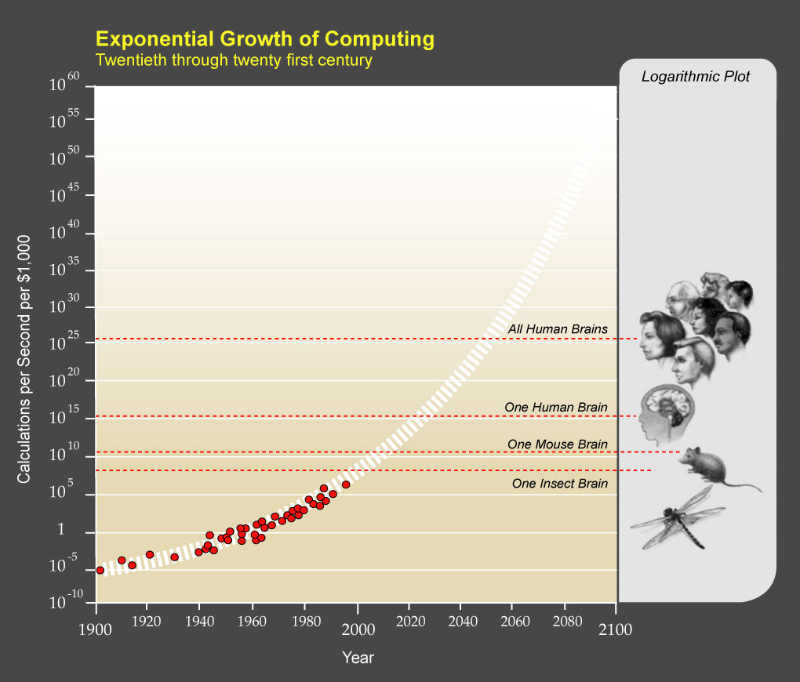

* [CGP Grey: Humans Need Not Apply](https://youtu.be/7Pq-S557XQU)
* [Kurzgesagt: The Rise of the Machines - Why automation is different this time](https://youtu.be/WSKi8HfcxEk)
* [Economics Explained: The Economics of Automation - What does our machine future look like?](https://youtu.be/Gc_nLK4ji_k)

### Smaller, Faster, Lighter, Denser, Cheaper

#### Atoms, Bits, Insights

#### Elon Musk 

[strategically changing the market by changing the economics of something](https://youtu.be/h97fXhDN5qE)

#### Quality is _ALWAYS_ about cost

* Quality is primarily about eliminating waste

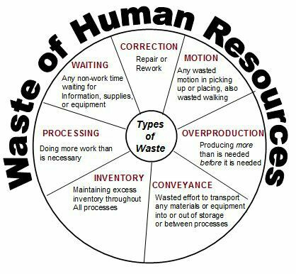

### Programmable, Elastic, Virtualized

#### Where are applications and where can Programmability influence them?
#### Where are applications and where can Elasticity influence them?
#### Where are applications and where can Virtualization influence them?

### Inverting the product game
_Carrier-grade >> Enterprise >> Consumer >> Utility_

#### Steve Jobs
[At Apple, people are putting in 18-hour days.  We attract a different type of person - a person who doesn't want to wait five or ten years to have someone take a giant risk on him or her.  Someone who really wants to <em><b>get in a little over his head and make a little dent in the universe</b></em>](https://solvenext.com/blog/steve-jobs-dent-in-the-universethe-shocking-truth-revealed)

Why do we do what we do...

#### User Experience

#### Context

["...the street finds its own uses for things"][Burning Chrome]

[Burning Chrome]: https://example.com/burning_chrome "Gibson, William, Burning Chrome, 1982"

[O'Reilly book: Understanding Context](https://learning.oreilly.com/library/view/understanding-context/9781449326531/)

#### Infrastructure versus Tenants

#### Local Administration versus Global Administration

#### Platforms
#### Things connected to Platforms
#### Platforms connected to Platforms
#### Mascots

## Part 2

## The Road Ahead

### Where are we now?

#### State Management

#### Networking and Internetworking

#### Infrastructure

### Where are we going?

#### The future of Configuration State Management

#### The future of Networking and Internetworking

#### The Future of Infrastructure

### Three Years
_This is the Operational baseline (Today -- 2021 to 2024)_

_In three years we will be selling yesterday's innovations_

* Today's customers are not all comfortable using VMs, a 20 year old technology
* Today's customers are (mostly) still our customers in three years
* Today's products don't work together and _that is the biggest problem to solve in the next three years_ because if we don't solve it we can't do anything else.
  1. move HTTPS config from A to B to C (portability between products)
  2. all feature modules on all data planes
  3. shared engineering standards
  4. opinionated reference architecture from app to application  

_In three years we will *also* be selling simplification_

* Concept to Code as a Service (C2CaaS) 

  Eg., quickly build an app, package that app with an Nginx Unit application server, deploy that app to the Cloud or the Edge with an Operations as a Service SaaS application.

* [Microsoft: The Low Code Revolution](https://youtu.be/JwM9NrePPMc)

### On the Edge is a Thing
_How do you "thingify" a complex system?_

### Things connect to Platforms
_How do you operate, secure, and trust Things you can't touch?_

### Services to Create Adaptive Applications (Concept to Code to Customer)
_How do you trust and monetize a service you can't control?_

## Five Years
_This is the Planning baseline (Tomorrow -- 2024 to 2026)_

_In five years we will be selling today's innovations_

## Seven Years
_This is the Development baseline (Day after tomorrow -- 2026 to 2029)_

_In seven years we will be selling tomorrow's innovations_

## Appendix 1 - Narrative Structure Framework

### Three time baselines
  
  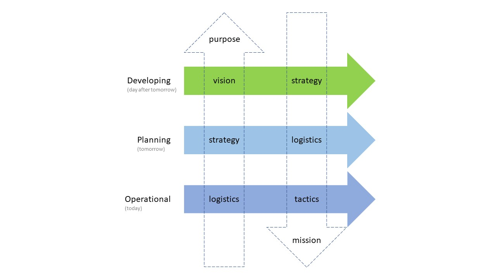

### Matrix of Categorical Functions

  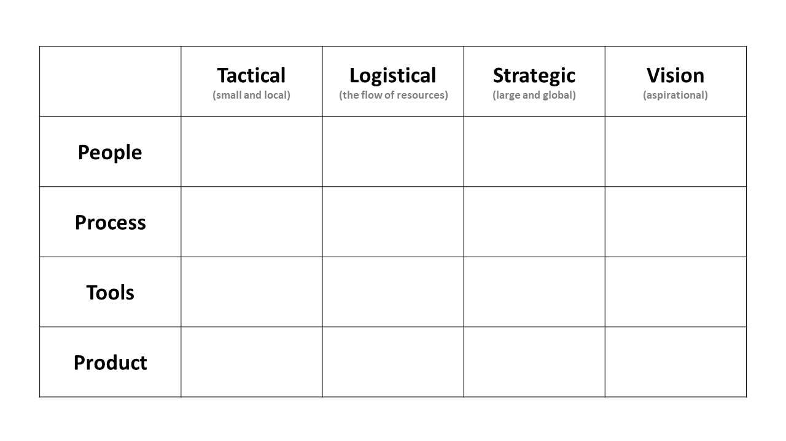

### Taxonomy of Levels of Technical Conversations

  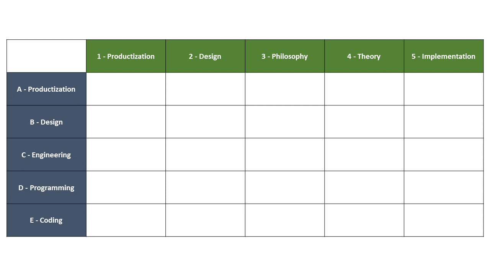

#### *LEVELS*
  * A - PRODUCTIZATION: Delivering Customer Value to create profit. 
  * B - DESIGN: Creating solutions to resolve problems that cause customer pain 
  * C - ENGINEERING: Writing, testing, maintaining, upgrading, documenting, and operating the system – at the org level
  * D - PROGRAMMING: Writing, testing, maintaining, upgrading, documenting, and operating the program – at the team level
  * E - CODING: Writing, testing, maintaining, upgrading, documenting, and operating the code – at the person level

#### *TOPICS*
  * 1 - PRODUCTIZATION: Delivering Customer Value in the domain to create profit. 
  * 2 - DESIGN: Creating solutions to resolve problems in the domain that cause customer pain 
  * 3 - PHILOSOPHY: Wisdom about the domain that helps you see that domain in the world
  * 4 - THEORY: Wisdom that shapes how you form intentions when you interact with the world in the domain  
  * 5 - IMPLEMENTATION: Domain-specific details about how to practice in the domain

  A statement has both a topic and a level.  Ex. "Be stateless first.  If state is required, it must be shared.  When state is shared, it must be shared using messages."  is a Design Philosophy statement (B3).

  Good technical writing, and clear technical conversations, maintain the same Level while traversing the Topics.  This keeps the conversation clear and easy to follow and avoids rat holes.

### Maslow's Hierarchy of Needs
  
  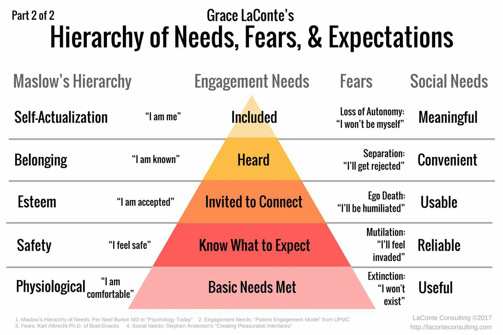
  
### Maturity Models
  
  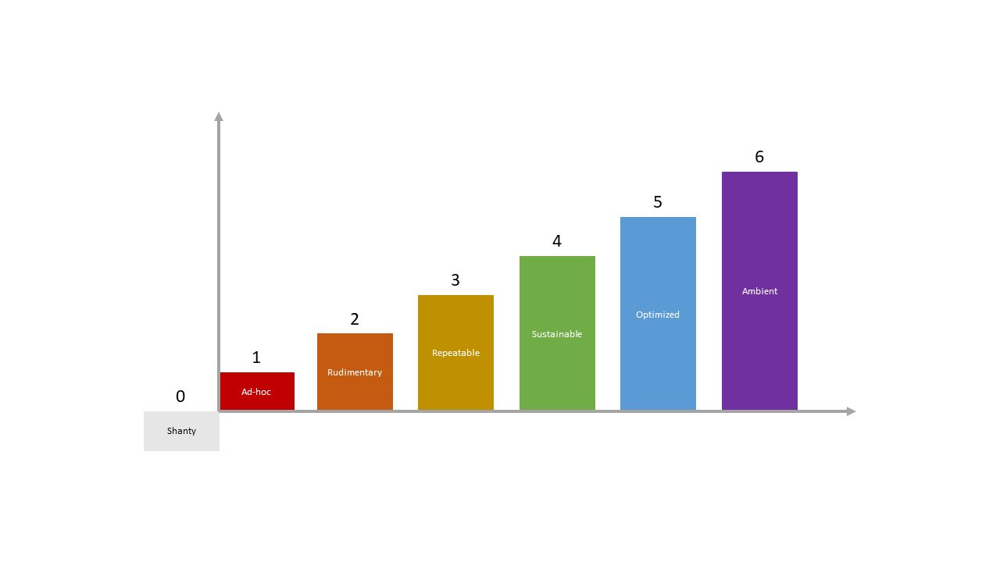

  Generic Maturity Model:

  0. Shanty - everyone is doing their own thing and competing for scarce resources
  1. Ad-hoc - no process but general concept of a common destination and cooperation
  2. Rudimentary - some primitive processes exist but aren't consistently followed
  3. Repeatable - demonstrable competence in delivering over time 
  4. Sustainable - consistently hitting targets and growing skills
  5. Optimal - finely tuned organization with no low-hanging fruit or obvious flaws in process, product, or politics
  6. Ambient - breathing the air is all it takes to integrate and become highly functional

## Appendix 2 - Doctrine

### Antifragile 
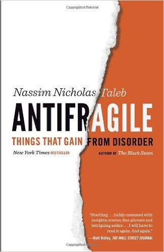
* Resiliency doesn't scale
* Availability at scale is really adaptability
* _Getting stronger because of systemic stressors is the acme of "Availability"_
### The Box
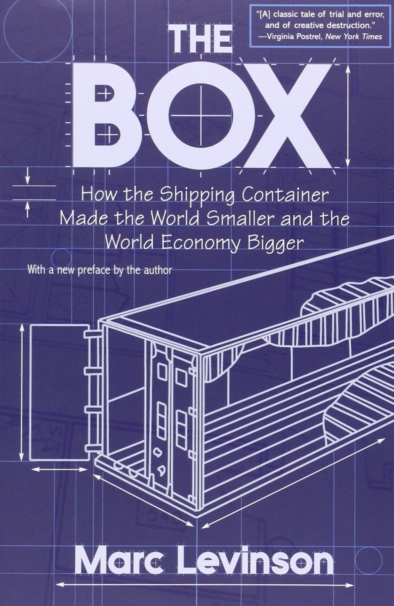
* Commoditization radically alters everything
* Standard containers means you don't care what's inside
* _The conveyance of fungible containers for inconsequential contents is the acme of "Fast"_
### Trillions
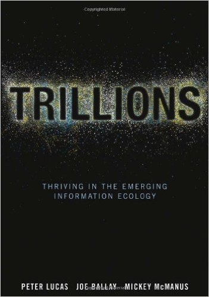
* We are thinking too small about the Internet of Things
* Design matters a lot more when there is no interface
* _Cutting away the overhead is the acme of "Scale"_
### Liars and Outliers
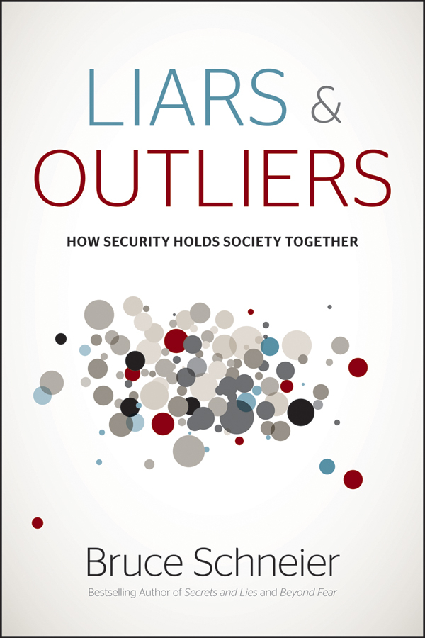
* Trust is a social problem
* Secure (and safe) are states in a social "state machine"
* _Ascertaining trustworthiness is the acme of "Secure"_

## Appendix 3 - What is a Product Ecosystem?

* Get thee to an Ecosystem!

## Appendix 4 - Physics and Metaphysics

* Matter
* Energy
* Information
  
* Force
* Capital
* Repute
* Culture

 
